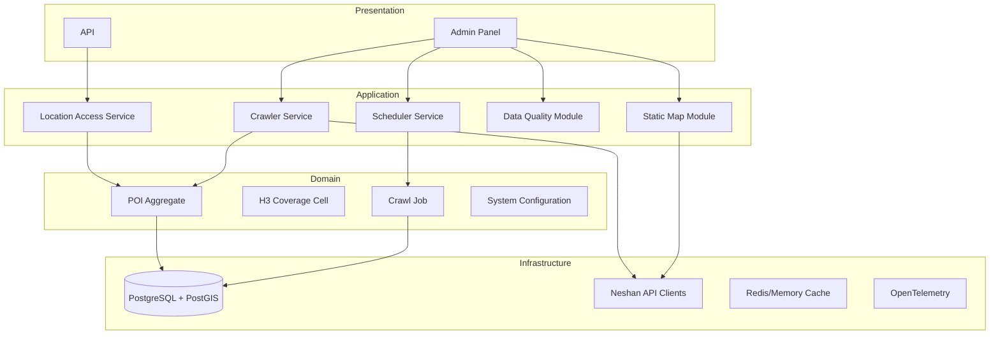
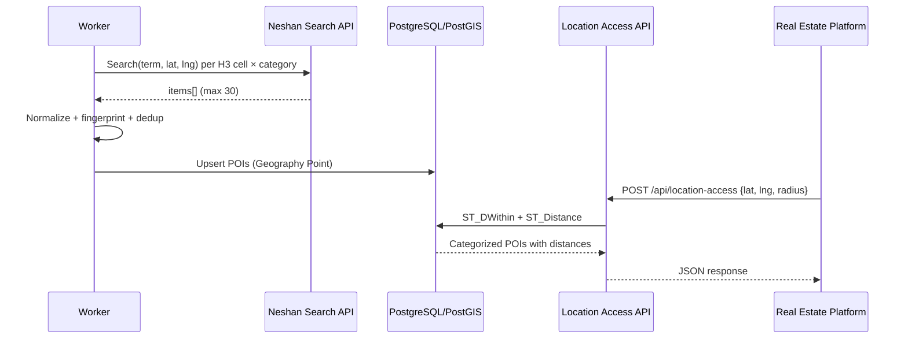

# Phase 1: Architecture Review

| Field | Value |
|-------|-------|
| Project | Didibood Location Access Service (POI Service) — Tehran |
| Phase | 1 of 11 |
| Status | **Complete — Approved** |
| Date | 2026-06-08 |

## 1. Executive Summary

Phase 1 validates Neshan API capabilities against project requirements before any implementation. The primary finding: **Neshan Search API does not expose stable POI identifiers**. The system must use deterministic fingerprinting and an H3-guided crawl strategy. Runtime queries use PostGIS exclusively.

See [ADR-001](./adr/001-neshan-poi-identity-and-crawl-strategy.md) for the formal decision record.

## 2. Neshan API Analysis (Verified)

### 2.1 Search API — Primary POI Source

| Attribute | Value |
|-----------|-------|
| Endpoint | `GET https://api.neshan.org/v1/search` |
| Auth | Header `Api-Key: <LocationApiKey>` |
| Parameters | `term` (required), `lat` (required), `lng` (required) |
| Max results | **30 per request** |
| Sort order | Distance from reference point |
| Documented response fields | `count`, `items[].title`, `address`, `neighbourhood`, `region`, `type`, `category`, `location.x`, `location.y` |
| POI identifier | **None documented** |

### 2.2 Related APIs Evaluated

| API | Version | POI Discovery? | ID Field? |
|-----|---------|----------------|-----------|
| Search | v1 | Yes (primary) | No |
| Geocoding | v6 | No (address → coord) | No |
| Geocoding Plus | v1/plus | Partial (named place resolution) | No |
| Reverse Geocoding | v5 | No (coord → address) | No |
| Distance Matrix | v1 | No | No |
| Routing | v4 | No | No |
| Static Map | v5 | No (image only) | N/A |

**Place Details endpoint: does not exist** in the public Neshan API catalog.

### 2.3 Rate Limits and Quotas

| Constraint | Error Code | Public Documentation |
|------------|------------|---------------------|
| Requests per minute | 482 RateExceeded | Exists; exact RPM **not published** |
| Total quota per key | 481 LimitExceeded | Exists; value is **per-account**, visible in developer panel |
| Invalid key | 480 KeyNotFound | Documented |
| Wrong key type | 483 ApiKeyTypeError | Documented |
| IP whitelist | 484 ApiWhiteListError | Documented |
| Service scope | 485 ApiServiceListError | Documented |

### 2.4 Pricing

| Item | Detail |
|------|--------|
| Model | Pay-As-You-Go (account balance deduction) |
| Dev credit | 200,000 Toman for 3 months (new accounts) |
| Per-request tariff | **Not in public docs** — requires developer panel |
| Monitoring | Developer panel → Reports (`گزارشات`) |

**Action for Phase 3:** Record actual Search API and Static Map unit costs from the developer panel tariff page.

### 2.5 Error Codes (Shared Across APIs)

| HTTP | Status | Retry? |
|------|--------|--------|
| 400 | INVALID_ARGUMENT | No |
| 470 | CoordinateParseError | No |
| 480 | KeyNotFound | No |
| 481 | LimitExceeded | No (alert + pause crawl) |
| 482 | RateExceeded | Yes (backoff) |
| 483 | ApiKeyTypeError | No |
| 484 | ApiWhiteListError | No |
| 485 | ApiServiceListError | No |
| 500 | GenericError | Yes (limited) |
| 503 | render_timeout | Yes (Static Map) |
| 503 | overloaded | Yes |

## 3. Target Architecture

### 3.1 Solution Structure (Clean Architecture)

```
Didibood.LocationAccess.sln
├── Didibood.LocationAccess.Domain          # Entities, value objects, domain events
├── Didibood.LocationAccess.Application     # Use cases, interfaces, validators
├── Didibood.LocationAccess.Infrastructure  # EF Core, Neshan clients, PostGIS, H3, caching
├── Didibood.LocationAccess.API             # REST endpoints, health, Swagger
├── Didibood.LocationAccess.Admin           # Blazor/Razor admin panel
├── Didibood.LocationAccess.Worker          # Crawler + scheduler background host
└── Didibood.LocationAccess.Tests           # Unit + integration + spatial tests
```

### 3.2 Layer Responsibilities



### 3.3 Core Data Flow



### 3.4 Technology Stack

| Component | Technology |
|-----------|------------|
| Runtime | .NET 9, ASP.NET Core |
| Database | PostgreSQL 16+ with PostGIS, hstore, pgcrypto |
| Spatial runtime | PostGIS `Geography(Point,4326)` |
| Crawl planning | H3 (res 8 primary, res 9 re-crawl) |
| ORM | EF Core + Npgsql.NetTopologySuite |
| Resilience | Polly |
| Validation | FluentValidation |
| Logging | Serilog (structured) |
| Observability | OpenTelemetry |
| Caching | IMemoryCache / Redis (TBD Phase 4) |
| Admin maps | Neshan Maps JS SDK + Static Map API |
| Containerization | Docker Compose |

### 3.5 Key Interfaces (Infrastructure Abstractions)

```csharp
// POI ingestion
INeshanSearchClient
IPoiNormalizer
IPoiFingerprintService
IPoiRepository

// Runtime
ILocationAccessService

// Crawl
ICrawlPlanner          // H3 cell generation
ICrawlExecutor
ICrawlJobRepository

// Static maps
IStaticMapProvider     // extensible
INeshanStaticMapService : IStaticMapProvider

// Config
ISystemConfigurationStore  // DB-backed overrides
```

## 4. POI Category → Search Term Mapping (Draft)

Neshan Search has no category filter. Each internal category maps to one or more Persian search terms:

| Internal Category | Neshan Search Terms (examples) |
|-------------------|-------------------------------|
| Metro | `ایستگاه مترو`, `مترو` |
| BRT | `ایستگاه BRT`, `اتوبوس تندرو` |
| Bus | `ایستگاه اتوبوس` |
| School | `مدرسه`, `دبستان`, `دبیرستان` |
| University | `دانشگاه`, `دانشکده` |
| Hospital | `بیمارستان` |
| Clinic | `درمانگاه`, `کلینیک` |
| Pharmacy | `داروخانه` |
| ShoppingCenter | `مرکز خرید`, `مجتمع تجاری` |
| Supermarket | `سوپرمارکت`, `هایپرمارکت` |
| Park | `پارک`, `بوستان` |
| Gym | `باشگاه ورزشی`, `سالن ورزشی` |
| Bank | `بانک`, `شعبه بانک` |
| Mosque | `مسجد` |
| GovernmentOffice | `اداره`, `دفتر پیشخوان` |

Filter ingest: keep `category = place` from Neshan response; exclude `municipal` and `region` unless explicitly mapped.

## 5. H3 Resolution Decision

**Primary crawl: Resolution 8**

- Greater Tehran bounding box: approx. `35.48°–35.92°N`, `51.08°–51.65°E`
- Estimated cells: ~1,200–1,800
- With 16 categories × ~2 terms avg × 1,500 cells ≈ **48,000 Search API calls** for initial full crawl
- At 30 results/call → up to 1.44M raw results (heavy dedup expected)

**Coverage monitor / re-crawl: Resolution 9** for failed/stale cells only.

## 6. Non-Functional Architecture

| NFR | Approach |
|-----|----------|
| Production ready | Health checks, fail-fast startup, structured logging |
| Docker | Multi-stage builds; compose with PostgreSQL/PostGIS |
| Rate limiting | ASP.NET rate limiter on API; token bucket on crawler |
| Caching | Response cache for location-access; SHA256 cache for static maps |
| Startup validation | DB, PostGIS, Neshan config, API connectivity, tables |
| Secret management | Env vars > appsettings; never hardcode keys |

## 7. Risks

| ID | Risk | Severity | Mitigation |
|----|------|----------|------------|
| R1 | No stable Neshan POI ID | High | ADR-001 fingerprint strategy |
| R2 | 30-result cap in dense areas | High | Multi-term search; overlapping H3 cells |
| R3 | Unknown rate/quota limits | Medium | Phase 3 empirical testing; conservative concurrency |
| R4 | Unknown per-request cost | Medium | Panel tariff review; crawl cost estimator in Admin |
| R5 | Fingerprint instability on POI updates | Medium | Supersede + proximity matching in dedup |
| R6 | Persian text normalization edge cases | Low | ICU normalization; test with real Tehran data |
| R7 | API key invalid in dev environment | Low | Phase 3 key validation; separate secrets per env |

## 8. Assumptions

| ID | Assumption | Validation |
|----|------------|------------|
| A1 | Search API is sufficient for all 16 POI categories | Phase 3 term mapping validation |
| A2 | `LocationApiKey` is scoped to Search; `ApiKey` to Static Map | Phase 3 startup health check |
| A3 | PostGIS `ST_Distance` on Geography is acceptable for display distances | Phase 7 spatial tests |
| A4 | Tehran coverage fits within reasonable API budget | Phase 3 cost projection |
| A5 | No undocumented `id` field will be added without notice | Monitor Neshan changelog; fingerprint remains canonical |

## 9. Deliverables (Phase 1)

| Deliverable | Location | Status |
|-------------|----------|--------|
| Neshan API analysis | This document §2 | Done |
| ADR-001 POI identity | `docs/adr/001-*.md` | Done |
| Architecture overview | This document §3 | Done |
| H3 resolution rationale | ADR-001 + §5 | Done |
| Work package breakdown | `docs/work-packages.md` | Done |
| Phase gate checklist | This document §10 | Done |

## 10. Phase Gate Checklist

Before proceeding to **Phase 2 (Database Design)**:

- [x] Neshan POI identifier question answered (No → fingerprint)
- [x] Rate/quota/pricing documented with knowns and unknowns
- [x] API combination strategy defined
- [x] H3 vs PostGIS boundary defined
- [x] ADR-001 accepted
- [x] Stakeholder review of Phase 1 deliverables (approved 2026-06-08)
- [ ] Developer panel tariff captured (Phase 3 prerequisite)
- [ ] Valid API keys confirmed for dev environment

## 11. Next Phase Preview

**Phase 2 — Database Design** will produce:

- ER diagram for POIs, categories, H3 coverage, crawl jobs, system config, static map snapshots
- PostGIS schema with `Geography(Point,4326)` and spatial indexes
- Migration strategy with auto-create DB + extensions (postgis, hstore, pgcrypto)
- Seed data for categories and default configuration

**Assigned agent:** SQL Engineer + Backend Engineer (review by Orchestrator)
