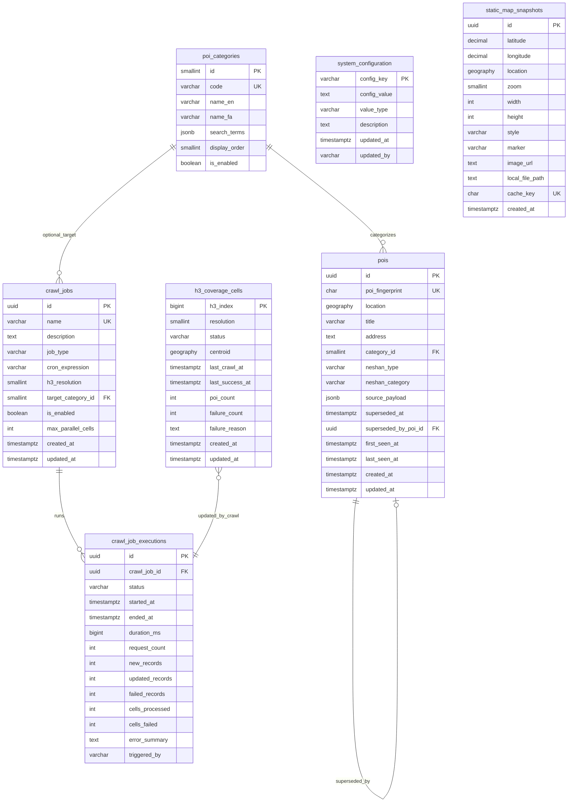

# Phase 2: Database Design

| Field | Value |
|-------|-------|
| Project | Didibood Location Access Service (POI Service) — Tehran |
| Phase | 2 of 11 |
| Status | **Complete — Approved** |
| Date | 2026-06-08 |
| Primary Agent | SQL Engineer |
| Reviewer | Backend Engineer, Orchestrator |

## 1. Executive Summary

Phase 2 defines the PostgreSQL 16+ schema for the Didibood POI Service: seven entity groups, PostGIS `geography(Point,4326)` for all coordinates, GiST spatial indexes, deterministic `PoiFingerprint` identity (ADR-001), and H3 coverage metadata confined to crawl tables (not runtime queries). EF Core migrations are planned for Phase 4; this document provides canonical DDL, seed specifications, and spatial query prototypes.

Spatial model decisions are recorded in [ADR-002](./adr/002-postgis-spatial-model.md).

## 2. Connection & Bootstrap

### 2.1 Target Instance

| Setting | Value |
|---------|-------|
| Host | `localhost` |
| Port | `5432` |
| Database | `DiDiboodMapDB` |
| User | `postgres` |
| Password | From environment / `appsettings` (never committed) |

**Connection string template (Phase 4):**

```
Host=localhost;Port=5432;Database=DiDiboodMapDB;Username=postgres;Password=${POSTGRES_PASSWORD}
```

Npgsql options: `Include Error Detail=true` (dev only); NetTopologySuite enabled for geography mapping.

### 2.2 Auto-Create Database

Phase 4 infrastructure will connect to the `postgres` maintenance database, check existence, and create `DiDiboodMapDB` if missing. Bootstrap script: [§8 Migration/Bootstrap Script](#8-migrationbootstrap-script).

### 2.3 Required Extensions

| Extension | Purpose |
|-----------|---------|
| `postgis` | `geography`, `ST_DWithin`, `ST_Distance`, GiST |
| `hstore` | Future key-value tags on POIs / config (Phase 5+); enabled at bootstrap |
| `pgcrypto` | `digest()` for fingerprint verification in SQL tooling |

## 3. Entity-Relationship Model



## 4. Table Specifications

### 4.1 `poi_categories`

Reference dimension for the 16 internal POI categories. Search terms are stored as JSONB array for crawl term dictionary (Phase 5).

| Column | Type | Constraints | Notes |
|--------|------|-------------|-------|
| `id` | `SMALLINT` | PK | Stable 1–16 |
| `code` | `VARCHAR(50)` | NOT NULL, UNIQUE | e.g. `metro`, `shoppingCenter` |
| `name_en` | `VARCHAR(100)` | NOT NULL | English display label |
| `name_fa` | `VARCHAR(100)` | NOT NULL | Persian display label |
| `search_terms` | `JSONB` | NOT NULL, default `[]` | Persian Neshan search terms |
| `display_order` | `SMALLINT` | NOT NULL | UI sort |
| `is_enabled` | `BOOLEAN` | NOT NULL, default `true` | Disable crawl per category |
| `created_at` | `TIMESTAMPTZ` | NOT NULL, default `now()` | |
| `updated_at` | `TIMESTAMPTZ` | NOT NULL, default `now()` | |

**Indexes:** PK (`id`), UNIQUE (`code`).

---

### 4.2 `pois`

Canonical POI store. Identity = `poi_fingerprint` (SHA-256 hex, ADR-001). `id` is surrogate UUID for FKs and API outward references.

| Column | Type | Constraints | Notes |
|--------|------|-------------|-------|
| `id` | `UUID` | PK, default `gen_random_uuid()` | Surrogate key |
| `poi_fingerprint` | `CHAR(64)` | NOT NULL, UNIQUE | SHA-256 hex |
| `location` | `geography(Point,4326)` | NOT NULL | WGS 84 point |
| `title` | `VARCHAR(500)` | NOT NULL | Normalized display title |
| `address` | `TEXT` | NULL | |
| `category_id` | `SMALLINT` | NOT NULL, FK → `poi_categories` | Internal category |
| `neshan_type` | `VARCHAR(100)` | NULL | Neshan `type` field |
| `neshan_category` | `VARCHAR(50)` | NULL | `place`, `municipal`, `region` |
| `source_payload` | `JSONB` | NOT NULL | Raw Neshan item JSON |
| `superseded_at` | `TIMESTAMPTZ` | NULL | Set when fingerprint replaced |
| `superseded_by_poi_id` | `UUID` | NULL, FK → `pois(id)` | Replacement POI |
| `first_seen_at` | `TIMESTAMPTZ` | NOT NULL | First successful ingest |
| `last_seen_at` | `TIMESTAMPTZ` | NOT NULL | Last crawl sighting |
| `created_at` | `TIMESTAMPTZ` | NOT NULL, default `now()` | |
| `updated_at` | `TIMESTAMPTZ` | NOT NULL, default `now()` | |

**Constraints:**

- `chk_pois_neshan_category` — `neshan_category IN ('place','municipal','region')` OR NULL
- `chk_pois_superseded_consistency` — `(superseded_at IS NULL AND superseded_by_poi_id IS NULL) OR (superseded_at IS NOT NULL)`
- Default ingest filter (application): keep `neshan_category = 'place'` unless explicitly mapped (Phase 1 §4)

**Indexes:** see [§6 Index Strategy](#6-index-strategy).

---

### 4.3 `h3_coverage_cells`

Crawl coverage tracker. **Not referenced by runtime location queries.**

| Column | Type | Constraints | Notes |
|--------|------|-------------|-------|
| `h3_index` | `BIGINT` | PK | 64-bit H3 cell index |
| `resolution` | `SMALLINT` | NOT NULL, CHECK 0–15 | 8 primary, 9 re-crawl |
| `status` | `VARCHAR(20)` | NOT NULL | See enum below |
| `centroid` | `geography(Point,4326)` | NOT NULL | Cell center |
| `last_crawl_at` | `TIMESTAMPTZ` | NULL | Last attempt |
| `last_success_at` | `TIMESTAMPTZ` | NULL | Last successful crawl |
| `poi_count` | `INT` | NOT NULL, default 0 | POIs attributed in last success |
| `failure_count` | `INT` | NOT NULL, default 0 | Consecutive failures |
| `failure_reason` | `TEXT` | NULL | Last error message |
| `created_at` | `TIMESTAMPTZ` | NOT NULL, default `now()` | |
| `updated_at` | `TIMESTAMPTZ` | NOT NULL, default `now()` | |

**Status enum (`h3_coverage_cells.status`):**

| Value | Meaning |
|-------|---------|
| `pending` | Seeded, never crawled |
| `success` | Last crawl completed OK |
| `failed` | Last crawl failed (retry eligible) |
| `stale` | Success older than staleness threshold |

---

### 4.4 `crawl_jobs`

Scheduler definition (Phase 6). Cron-driven or manual trigger.

| Column | Type | Constraints | Notes |
|--------|------|-------------|-------|
| `id` | `UUID` | PK | |
| `name` | `VARCHAR(200)` | NOT NULL, UNIQUE | e.g. `tehran-full-res8` |
| `description` | `TEXT` | NULL | |
| `job_type` | `VARCHAR(50)` | NOT NULL | `full_crawl`, `stale_refresh`, `category_refresh`, `res9_recrawl` |
| `cron_expression` | `VARCHAR(100)` | NULL | NCronTab / Quartz format |
| `h3_resolution` | `SMALLINT` | NOT NULL, default 8 | |
| `target_category_id` | `SMALLINT` | NULL, FK → `poi_categories` | NULL = all categories |
| `is_enabled` | `BOOLEAN` | NOT NULL, default `true` | |
| `max_parallel_cells` | `INT` | NOT NULL, default 2 | Overridable via config |
| `created_at` | `TIMESTAMPTZ` | NOT NULL | |
| `updated_at` | `TIMESTAMPTZ` | NOT NULL | |

---

### 4.5 `crawl_job_executions`

Per-run audit log.

| Column | Type | Constraints | Notes |
|--------|------|-------------|-------|
| `id` | `UUID` | PK | |
| `crawl_job_id` | `UUID` | NOT NULL, FK → `crawl_jobs` ON DELETE RESTRICT | |
| `status` | `VARCHAR(20)` | NOT NULL | `running`, `completed`, `failed`, `cancelled` |
| `started_at` | `TIMESTAMPTZ` | NOT NULL | |
| `ended_at` | `TIMESTAMPTZ` | NULL | |
| `duration_ms` | `BIGINT` | NULL | Computed on completion |
| `request_count` | `INT` | NOT NULL, default 0 | Neshan API calls |
| `new_records` | `INT` | NOT NULL, default 0 | POI inserts |
| `updated_records` | `INT` | NOT NULL, default 0 | POI updates |
| `failed_records` | `INT` | NOT NULL, default 0 | Ingest failures |
| `cells_processed` | `INT` | NOT NULL, default 0 | |
| `cells_failed` | `INT` | NOT NULL, default 0 | |
| `error_summary` | `TEXT` | NULL | |
| `triggered_by` | `VARCHAR(50)` | NOT NULL | `scheduler`, `manual`, `api` |

---

### 4.6 `system_configuration`

DB-backed overrides for `ISystemConfigurationStore`. Keys are dot-notation strings.

| Column | Type | Constraints | Notes |
|--------|------|-------------|-------|
| `config_key` | `VARCHAR(100)` | PK | |
| `config_value` | `TEXT` | NOT NULL | Serialized value |
| `value_type` | `VARCHAR(20)` | NOT NULL | `int`, `decimal`, `bool`, `string`, `json` |
| `description` | `TEXT` | NULL | Admin UI help text |
| `updated_at` | `TIMESTAMPTZ` | NOT NULL | |
| `updated_by` | `VARCHAR(100)` | NULL | User or `system` |

**Standard keys:**

| config_key | value_type | Default | Description |
|------------|------------|---------|-------------|
| `search.radius.default_meters` | `int` | `2000` | Default search radius (100–10000) |
| `search.max_results_per_category` | `int` | `20` | Max POIs returned per category (spec default) |
| `crawl.batch_size` | `int` | `10` | Cells per batch |
| `crawl.parallelism` | `int` | `2` | Concurrent Neshan requests |
| `crawl.retry.count` | `int` | `3` | Retries for transient errors |
| `crawl.retry.delay_ms` | `int` | `2000` | Base backoff delay |
| `crawl.stale_threshold_days` | `int` | `30` | Days before cell → `stale` |
| `tehran.bounds` | `json` | see seed | Bounding box for H3 seed |

---

### 4.7 `static_map_snapshots`

Cached Neshan Static Map images (Admin / Coverage Monitor).

| Column | Type | Constraints | Notes |
|--------|------|-------------|-------|
| `id` | `UUID` | PK | |
| `latitude` | `DECIMAL(9,6)` | NOT NULL | Request param |
| `longitude` | `DECIMAL(9,6)` | NOT NULL | Request param |
| `location` | `geography(Point,4326)` | NOT NULL | Derived from lat/lng |
| `zoom` | `SMALLINT` | NOT NULL | |
| `width` | `INT` | NOT NULL | Pixels |
| `height` | `INT` | NOT NULL | Pixels |
| `style` | `VARCHAR(100)` | NULL | Neshan style param |
| `marker` | `VARCHAR(500)` | NULL | Marker query fragment |
| `image_url` | `TEXT` | NULL | Remote URL if not stored locally |
| `local_file_path` | `TEXT` | NULL | On-disk cache path |
| `cache_key` | `CHAR(64)` | NOT NULL, UNIQUE | SHA-256 of canonical param string |
| `created_at` | `TIMESTAMPTZ` | NOT NULL | |

**Cache key canonical string (application layer):**

```
{lat:F6}|{lng:F6}|z{zoom}|{width}x{height}|{style}|{marker}
cache_key = SHA256(UTF-8(canonical))
```

## 5. Full DDL (PostgreSQL)

```sql
-- =============================================================================
-- Didibood Location Access Service — Phase 2 Canonical DDL
-- PostgreSQL 16+ | PostGIS 3.4+
-- =============================================================================

-- Run against maintenance DB (postgres) — see §8 bootstrap
-- \c DiDiboodMapDB

CREATE EXTENSION IF NOT EXISTS postgis;
CREATE EXTENSION IF NOT EXISTS hstore;
CREATE EXTENSION IF NOT EXISTS pgcrypto;

-- -----------------------------------------------------------------------------
-- poi_categories
-- -----------------------------------------------------------------------------
CREATE TABLE poi_categories (
    id              SMALLINT        PRIMARY KEY,
    code            VARCHAR(50)     NOT NULL,
    name_en         VARCHAR(100)    NOT NULL,
    name_fa         VARCHAR(100)    NOT NULL,
    search_terms    JSONB           NOT NULL DEFAULT '[]'::jsonb,
    display_order   SMALLINT        NOT NULL,
    is_enabled      BOOLEAN         NOT NULL DEFAULT TRUE,
    created_at      TIMESTAMPTZ     NOT NULL DEFAULT now(),
    updated_at      TIMESTAMPTZ     NOT NULL DEFAULT now(),
    CONSTRAINT uq_poi_categories_code UNIQUE (code)
);

-- -----------------------------------------------------------------------------
-- pois
-- -----------------------------------------------------------------------------
CREATE TABLE pois (
    id                      UUID            PRIMARY KEY DEFAULT gen_random_uuid(),
    poi_fingerprint         CHAR(64)        NOT NULL,
    location                geography(Point, 4326) NOT NULL,
    title                   VARCHAR(500)    NOT NULL,
    address                 TEXT,
    category_id             SMALLINT        NOT NULL REFERENCES poi_categories(id),
    neshan_type             VARCHAR(100),
    neshan_category         VARCHAR(50),
    source_payload          JSONB           NOT NULL,
    superseded_at           TIMESTAMPTZ,
    superseded_by_poi_id    UUID            REFERENCES pois(id),
    first_seen_at           TIMESTAMPTZ     NOT NULL,
    last_seen_at            TIMESTAMPTZ     NOT NULL,
    created_at              TIMESTAMPTZ     NOT NULL DEFAULT now(),
    updated_at              TIMESTAMPTZ     NOT NULL DEFAULT now(),
    CONSTRAINT uq_pois_fingerprint UNIQUE (poi_fingerprint),
    CONSTRAINT chk_pois_neshan_category
        CHECK (neshan_category IS NULL OR neshan_category IN ('place', 'municipal', 'region')),
    CONSTRAINT chk_pois_superseded_consistency
        CHECK (
            (superseded_at IS NULL AND superseded_by_poi_id IS NULL)
            OR (superseded_at IS NOT NULL)
        )
);

-- -----------------------------------------------------------------------------
-- h3_coverage_cells
-- -----------------------------------------------------------------------------
CREATE TABLE h3_coverage_cells (
    h3_index        BIGINT          PRIMARY KEY,
    resolution      SMALLINT        NOT NULL,
    status          VARCHAR(20)     NOT NULL,
    centroid        geography(Point, 4326) NOT NULL,
    last_crawl_at   TIMESTAMPTZ,
    last_success_at TIMESTAMPTZ,
    poi_count       INT             NOT NULL DEFAULT 0,
    failure_count   INT             NOT NULL DEFAULT 0,
    failure_reason  TEXT,
    created_at      TIMESTAMPTZ     NOT NULL DEFAULT now(),
    updated_at      TIMESTAMPTZ     NOT NULL DEFAULT now(),
    CONSTRAINT chk_h3_resolution CHECK (resolution BETWEEN 0 AND 15),
    CONSTRAINT chk_h3_status CHECK (status IN ('pending', 'success', 'failed', 'stale'))
);

-- -----------------------------------------------------------------------------
-- crawl_jobs
-- -----------------------------------------------------------------------------
CREATE TABLE crawl_jobs (
    id                  UUID            PRIMARY KEY DEFAULT gen_random_uuid(),
    name                VARCHAR(200)    NOT NULL,
    description         TEXT,
    job_type            VARCHAR(50)     NOT NULL,
    cron_expression     VARCHAR(100),
    h3_resolution       SMALLINT        NOT NULL DEFAULT 8,
    target_category_id  SMALLINT        REFERENCES poi_categories(id),
    is_enabled          BOOLEAN         NOT NULL DEFAULT TRUE,
    max_parallel_cells  INT             NOT NULL DEFAULT 2,
    created_at          TIMESTAMPTZ     NOT NULL DEFAULT now(),
    updated_at          TIMESTAMPTZ     NOT NULL DEFAULT now(),
    CONSTRAINT uq_crawl_jobs_name UNIQUE (name),
    CONSTRAINT chk_crawl_job_type
        CHECK (job_type IN ('full_crawl', 'stale_refresh', 'category_refresh', 'res9_recrawl'))
);

-- -----------------------------------------------------------------------------
-- crawl_job_executions
-- -----------------------------------------------------------------------------
CREATE TABLE crawl_job_executions (
    id                  UUID            PRIMARY KEY DEFAULT gen_random_uuid(),
    crawl_job_id        UUID            NOT NULL REFERENCES crawl_jobs(id) ON DELETE RESTRICT,
    status              VARCHAR(20)     NOT NULL,
    started_at          TIMESTAMPTZ     NOT NULL,
    ended_at            TIMESTAMPTZ,
    duration_ms         BIGINT,
    request_count       INT             NOT NULL DEFAULT 0,
    new_records         INT             NOT NULL DEFAULT 0,
    updated_records     INT             NOT NULL DEFAULT 0,
    failed_records      INT             NOT NULL DEFAULT 0,
    cells_processed     INT             NOT NULL DEFAULT 0,
    cells_failed        INT             NOT NULL DEFAULT 0,
    error_summary       TEXT,
    triggered_by        VARCHAR(50)     NOT NULL,
    CONSTRAINT chk_crawl_execution_status
        CHECK (status IN ('running', 'completed', 'failed', 'cancelled')),
    CONSTRAINT chk_crawl_triggered_by
        CHECK (triggered_by IN ('scheduler', 'manual', 'api'))
);

-- -----------------------------------------------------------------------------
-- system_configuration
-- -----------------------------------------------------------------------------
CREATE TABLE system_configuration (
    config_key      VARCHAR(100)    PRIMARY KEY,
    config_value    TEXT            NOT NULL,
    value_type      VARCHAR(20)     NOT NULL,
    description     TEXT,
    updated_at      TIMESTAMPTZ     NOT NULL DEFAULT now(),
    updated_by      VARCHAR(100),
    CONSTRAINT chk_system_config_value_type
        CHECK (value_type IN ('int', 'decimal', 'bool', 'string', 'json'))
);

-- -----------------------------------------------------------------------------
-- static_map_snapshots
-- -----------------------------------------------------------------------------
CREATE TABLE static_map_snapshots (
    id              UUID            PRIMARY KEY DEFAULT gen_random_uuid(),
    latitude        DECIMAL(9,6)    NOT NULL,
    longitude       DECIMAL(9,6)    NOT NULL,
    location        geography(Point, 4326) NOT NULL,
    zoom            SMALLINT        NOT NULL,
    width           INT             NOT NULL,
    height          INT             NOT NULL,
    style           VARCHAR(100),
    marker          VARCHAR(500),
    image_url       TEXT,
    local_file_path TEXT,
    cache_key       CHAR(64)        NOT NULL,
    created_at      TIMESTAMPTZ     NOT NULL DEFAULT now(),
    CONSTRAINT uq_static_map_cache_key UNIQUE (cache_key),
    CONSTRAINT chk_static_map_dimensions CHECK (width BETWEEN 1 AND 2048 AND height BETWEEN 1 AND 2048 AND zoom BETWEEN 5 AND 19)
);

-- -----------------------------------------------------------------------------
-- updated_at trigger (reusable)
-- -----------------------------------------------------------------------------
CREATE OR REPLACE FUNCTION set_updated_at()
RETURNS TRIGGER AS $$
BEGIN
    NEW.updated_at = now();
    RETURN NEW;
END;
$$ LANGUAGE plpgsql;

CREATE TRIGGER trg_poi_categories_updated_at
    BEFORE UPDATE ON poi_categories
    FOR EACH ROW EXECUTE FUNCTION set_updated_at();

CREATE TRIGGER trg_pois_updated_at
    BEFORE UPDATE ON pois
    FOR EACH ROW EXECUTE FUNCTION set_updated_at();

CREATE TRIGGER trg_h3_coverage_cells_updated_at
    BEFORE UPDATE ON h3_coverage_cells
    FOR EACH ROW EXECUTE FUNCTION set_updated_at();

CREATE TRIGGER trg_crawl_jobs_updated_at
    BEFORE UPDATE ON crawl_jobs
    FOR EACH ROW EXECUTE FUNCTION set_updated_at();
```

## 6. Index Strategy

### 6.1 Spatial (GiST)

| Index | Table | Column | Notes |
|-------|-------|--------|-------|
| `ix_pois_location_gist` | `pois` | `location` | Full spatial index (admin/DQM) |
| `ix_pois_active_location_gist` | `pois` | `location` | **Partial** `WHERE superseded_at IS NULL` — runtime hot path |
| `ix_h3_cells_centroid_gist` | `h3_coverage_cells` | `centroid` | Coverage map UI |
| `ix_static_maps_location_gist` | `static_map_snapshots` | `location` | Optional proximity in admin |

```sql
CREATE INDEX ix_pois_location_gist
    ON pois USING GIST (location);

CREATE INDEX ix_pois_active_location_gist
    ON pois USING GIST (location)
    WHERE superseded_at IS NULL;

CREATE INDEX ix_h3_cells_centroid_gist
    ON h3_coverage_cells USING GIST (centroid);

CREATE INDEX ix_static_maps_location_gist
    ON static_map_snapshots USING GIST (location);
```

### 6.2 B-tree / Lookup

| Index | Table | Columns | Purpose |
|-------|-------|---------|---------|
| `ix_pois_category_id` | `pois` | `category_id` | Category filter in location query |
| `ix_pois_last_seen_at` | `pois` | `last_seen_at` | Staleness / DQM |
| `ix_pois_superseded_by` | `pois` | `superseded_by_poi_id` | Supersession chain |
| `ix_h3_cells_status` | `h3_coverage_cells` | `status` | Crawl planner queue |
| `ix_h3_cells_resolution_status` | `h3_coverage_cells` | `resolution`, `status` | Res-9 re-crawl selection |
| `ix_h3_cells_last_crawl` | `h3_coverage_cells` | `last_crawl_at` | Stale detection |
| `ix_crawl_executions_job_started` | `crawl_job_executions` | `crawl_job_id`, `started_at DESC` | Admin history |
| `ix_crawl_executions_status` | `crawl_job_executions` | `status` | Running job monitor |
| `ix_static_maps_created_at` | `static_map_snapshots` | `created_at` | Cache eviction |

```sql
CREATE INDEX ix_pois_category_id ON pois (category_id);
CREATE INDEX ix_pois_last_seen_at ON pois (last_seen_at);
CREATE INDEX ix_pois_superseded_by ON pois (superseded_by_poi_id) WHERE superseded_by_poi_id IS NOT NULL;

CREATE INDEX ix_h3_cells_status ON h3_coverage_cells (status);
CREATE INDEX ix_h3_cells_resolution_status ON h3_coverage_cells (resolution, status);
CREATE INDEX ix_h3_cells_last_crawl ON h3_coverage_cells (last_crawl_at);

CREATE INDEX ix_crawl_executions_job_started
    ON crawl_job_executions (crawl_job_id, started_at DESC);
CREATE INDEX ix_crawl_executions_status ON crawl_job_executions (status);

CREATE INDEX ix_static_maps_created_at ON static_map_snapshots (created_at);
```

### 6.3 EF Core Migration Notes (Phase 4)

- Use `Npgsql.EntityFrameworkCore.PostgreSQL.NetTopologySuite` for `geography` columns.
- Apply partial index via raw SQL in migration (`migrationBuilder.Sql(...)`) — EF fluent API has limited partial index support.
- Snake_case naming convention via `UseSnakeCaseNamingConvention()`.
- Seed data via `migrationBuilder.InsertData` or idempotent SQL script post-migration.

## 7. Seed Data Specification

### 7.1 POI Categories (15 rows)

Phase 1 and work packages reference “16 categories”; the approved category list contains **15 distinct types** (see assumption A-P2-1). Schema uses `SMALLINT id` — a 16th category can be added without migration.

| id | code | name_en | name_fa | display_order | search_terms (JSON array) |
|----|------|---------|---------|---------------|---------------------------|
| 1 | metro | Metro Station | ایستگاه مترو | 1 | `["ایستگاه مترو","مترو"]` |
| 2 | brt | BRT Station | ایستگاه BRT | 2 | `["ایستگاه BRT","اتوبوس تندرو"]` |
| 3 | bus | Bus Stop | ایستگاه اتوبوس | 3 | `["ایستگاه اتوبوس"]` |
| 4 | school | School | مدرسه | 4 | `["مدرسه","دبستان","دبیرستان"]` |
| 5 | university | University | دانشگاه | 5 | `["دانشگاه","دانشکده"]` |
| 6 | hospital | Hospital | بیمارستان | 6 | `["بیمارستان"]` |
| 7 | clinic | Clinic | درمانگاه | 7 | `["درمانگاه","کلینیک"]` |
| 8 | pharmacy | Pharmacy | داروخانه | 8 | `["داروخانه"]` |
| 9 | shoppingCenter | Shopping Center | مرکز خرید | 9 | `["مرکز خرید","مجتمع تجاری"]` |
| 10 | supermarket | Supermarket | سوپرمارکت | 10 | `["سوپرمارکت","هایپرمارکت"]` |
| 11 | park | Park | پارک | 11 | `["پارک","بوستان"]` |
| 12 | gym | Gym | باشگاه ورزشی | 12 | `["باشگاه ورزشی","سالن ورزشی"]` |
| 13 | bank | Bank | بانک | 13 | `["بانک","شعبه بانک"]` |
| 14 | mosque | Mosque | مسجد | 14 | `["مسجد"]` |
| 15 | governmentOffice | Government Office | اداره دولتی | 15 | `["اداره","دفتر پیشخوان"]` |

```sql
INSERT INTO poi_categories (id, code, name_en, name_fa, search_terms, display_order) VALUES
    (1,  'metro',            'Metro Station',       'ایستگاه مترو',    '["ایستگاه مترو","مترو"]', 1),
    (2,  'brt',              'BRT Station',         'ایستگاه BRT',     '["ایستگاه BRT","اتوبوس تندرو"]', 2),
    (3,  'bus',              'Bus Stop',            'ایستگاه اتوبوس',  '["ایستگاه اتوبوس"]', 3),
    (4,  'school',           'School',              'مدرسه',           '["مدرسه","دبستان","دبیرستان"]', 4),
    (5,  'university',       'University',          'دانشگاه',         '["دانشگاه","دانشکده"]', 5),
    (6,  'hospital',         'Hospital',            'بیمارستان',       '["بیمارستان"]', 6),
    (7,  'clinic',           'Clinic',              'درمانگاه',        '["درمانگاه","کلینیک"]', 7),
    (8,  'pharmacy',         'Pharmacy',            'داروخانه',        '["داروخانه"]', 8),
    (9,  'shoppingCenter',   'Shopping Center',     'مرکز خرید',        '["مرکز خرید","مجتمع تجاری"]', 9),
    (10, 'supermarket',      'Supermarket',         'سوپرمارکت',       '["سوپرمارکت","هایپرمارکت"]', 10),
    (11, 'park',             'Park',                'پارک',            '["پارک","بوستان"]', 11),
    (12, 'gym',              'Gym',                 'باشگاه ورزشی',    '["باشگاه ورزشی","سالن ورزشی"]', 12),
    (13, 'bank',             'Bank',                'بانک',            '["بانک","شعبه بانک"]', 13),
    (14, 'mosque',           'Mosque',              'مسجد',            '["مسجد"]', 14),
    (15, 'governmentOffice', 'Government Office',   'اداره دولتی',     '["اداره","دفتر پیشخوان"]', 15)
ON CONFLICT (id) DO NOTHING;
```

### 7.2 Default System Configuration

```sql
INSERT INTO system_configuration (config_key, config_value, value_type, description, updated_by) VALUES
    ('search.radius.default_meters', '2000', 'int', 'Default location search radius in meters (100-10000)', 'system'),
    ('search.max_results_per_category', '20', 'int', 'Maximum POIs returned per category in location-access response', 'system'),
    ('crawl.batch_size', '10', 'int', 'H3 cells dispatched per crawl batch', 'system'),
    ('crawl.parallelism', '2', 'int', 'Max concurrent Neshan Search API requests', 'system'),
    ('crawl.retry.count', '3', 'int', 'Retry attempts for transient Neshan errors (482, 503)', 'system'),
    ('crawl.retry.delay_ms', '2000', 'int', 'Base delay in ms for exponential backoff', 'system'),
    ('crawl.stale_threshold_days', '30', 'int', 'Days after success before H3 cell marked stale', 'system'),
    ('tehran.bounds', '{"minLat":35.48,"maxLat":35.92,"minLng":51.08,"maxLng":51.65}', 'json', 'Greater Tehran bounding box for H3 seed', 'system');
```

### 7.3 Default Crawl Jobs

| name | job_type | cron | h3_resolution |
|------|----------|------|---------------|
| `tehran-full-crawl-res8` | `full_crawl` | `0 2 * * 0` (weekly Sun 02:00) | 8 |
| `tehran-stale-refresh` | `stale_refresh` | `0 3 * * *` (daily 03:00) | 8 |
| `tehran-failed-recrawl-res9` | `res9_recrawl` | `0 4 * * 6` (Sat 04:00) | 9 |

### 7.4 Tehran H3 Resolution-8 Cells

**Not hand-seeded in SQL** — generated programmatically in Phase 4/5 bootstrap:

1. Read `tehran.bounds` from `system_configuration`.
2. Use H3 library (`H3Net` or `Uber.H3`) to polyfill bounding box at resolution 8.
3. Bulk insert ~1,200–1,800 rows into `h3_coverage_cells`:
   - `h3_index`, `resolution = 8`, `status = 'pending'`
   - `centroid = ST_SetSRID(ST_MakePoint(lng, lat), 4326)::geography`

**Idempotency:** `INSERT ... ON CONFLICT (h3_index) DO NOTHING`.

**Sample seed (3 cells for dev/integration tests):**

```sql
INSERT INTO h3_coverage_cells (h3_index, resolution, status, centroid) VALUES
    (882cf36d61fffff, 8, 'pending', ST_SetSRID(ST_MakePoint(51.3890, 35.6892), 4326)::geography),
    (882cf36d65fffff, 8, 'pending', ST_SetSRID(ST_MakePoint(51.4100, 35.7000), 4326)::geography),
    (882cf36d69fffff, 8, 'pending', ST_SetSRID(ST_MakePoint(51.3700, 35.6800), 4326)::geography)
ON CONFLICT (h3_index) DO NOTHING;
```

*(Replace with actual H3 indices from library at implementation time.)*

## 8. Migration/Bootstrap Script

### 8.1 Create Database + Extensions

```bash
#!/usr/bin/env bash
# scripts/bootstrap-db.sh — run from Phase 4 DevOps; canonical reference here
set -euo pipefail

PGHOST="${PGHOST:-localhost}"
PGPORT="${PGPORT:-5432}"
PGUSER="${PGUSER:-postgres}"
PGDATABASE="${PGDATABASE:-DiDiboodMapDB}"

export PGPASSWORD="${POSTGRES_PASSWORD:?POSTGRES_PASSWORD required}"

# Create database if missing
psql -h "$PGHOST" -p "$PGPORT" -U "$PGUSER" -d postgres -v ON_ERROR_STOP=1 <<SQL
SELECT 'CREATE DATABASE "${PGDATABASE}"'
WHERE NOT EXISTS (SELECT FROM pg_database WHERE datname = '${PGDATABASE}')\gexec
SQL

# Extensions (requires superuser or extension privileges)
psql -h "$PGHOST" -p "$PGPORT" -U "$PGUSER" -d "$PGDATABASE" -v ON_ERROR_STOP=1 <<SQL
CREATE EXTENSION IF NOT EXISTS postgis;
CREATE EXTENSION IF NOT EXISTS hstore;
CREATE EXTENSION IF NOT EXISTS pgcrypto;
SQL

echo "Database ${PGDATABASE} ready."
```

### 8.2 Apply Order (Phase 4 EF Core)

1. `bootstrap-db.sh` (or equivalent C# `EnsureCreated` pre-step)
2. EF migration `InitialCreate` — tables + triggers
3. EF migration `AddIndexes` — GiST + partial indexes (CONCURRENTLY in prod)
4. Seed migration `SeedCategoriesAndConfig`
5. Worker startup job — full H3 res-8 polyfill (production)

## 9. Spatial Query Examples

Reference point: Azadi Square area — `lat = 35.6997`, `lng = 51.3381`.

### 9.1 Parameterized Location Access Query

```sql
-- All active POIs within :radius_m meters, with distance, grouped-ready
WITH query AS (
    SELECT ST_SetSRID(ST_MakePoint(51.3381, 35.6997), 4326)::geography AS geom
)
SELECT
    p.id,
    p.poi_fingerprint,
    p.title,
    p.address,
    c.code AS category_code,
    c.name_fa AS category_name_fa,
    ST_Y(p.location::geometry) AS latitude,
    ST_X(p.location::geometry) AS longitude,
    ST_Distance(p.location, q.geom) AS distance_meters
FROM pois p
INNER JOIN poi_categories c ON c.id = p.category_id
CROSS JOIN query q
WHERE p.superseded_at IS NULL
  AND c.is_enabled = TRUE
  AND ST_DWithin(p.location, q.geom, :radius_m)  -- e.g. 2000
ORDER BY distance_meters
LIMIT :max_results;  -- e.g. 50
```

### 9.2 Category-Filtered Query

```sql
-- Same as §9.1 plus: AND c.code = ANY(:category_codes)
```

### 9.3 Radius Sweep (100 m – 10 000 m) — Test Harness

```sql
\set lat 35.6997
\set lng 51.3381

SELECT
    r.radius_m,
    COUNT(*) AS poi_count
FROM (VALUES (100),(500),(1000),(2000),(5000),(10000)) AS r(radius_m)
CROSS JOIN LATERAL (
    SELECT 1
    FROM pois p
    WHERE p.superseded_at IS NULL
      AND ST_DWithin(
          p.location,
          ST_SetSRID(ST_MakePoint(:lng, :lat), 4326)::geography,
          r.radius_m
      )
) sub
GROUP BY r.radius_m
ORDER BY r.radius_m;
```

### 9.4 EXPLAIN Notes

**Expected plan characteristics (after seed + ANALYZE):**

```
Limit
  -> Sort (distance_meters)
    -> Index Scan using ix_pois_active_location_gist on pois p
         Index Cond: (location && _st_expand(...))
         Filter: (superseded_at IS NULL AND st_dwithin(...))
```

| Observation | Interpretation |
|-------------|----------------|
| `Index Scan using ix_pois_active_location_gist` | GiST working — good |
| `Bitmap Index Scan` on GiST | Acceptable alternative at higher row counts |
| `Seq Scan on pois` | Missing/outdated index or statistics — run `ANALYZE pois` |
| `Filter: st_dwithin` without index cond | GiST not used — verify partial index predicate matches `superseded_at IS NULL` |
| Sort cost dominates at 10 km radius | Increase `search.max_results` cap; consider category pre-filter |

**Maintenance:**

```sql
ANALYZE pois;
-- After bulk crawl load:
-- CREATE INDEX CONCURRENTLY IF NOT EXISTS ix_pois_active_location_gist ...;
```

**NO H3 in runtime:** Verified — queries use only `ST_DWithin` / `ST_Distance` on `pois.location`.

## 10. Risks

| ID | Risk | Severity | Mitigation |
|----|------|----------|------------|
| R-P2-1 | Fingerprint supersession chain grows unbounded | Medium | Periodic archival job; DQM merge tool in Phase 8 |
| R-P2-2 | GiST index bloat after bulk initial crawl | Medium | `REINDEX INDEX CONCURRENTLY` post-crawl; monitor `pg_stat_user_indexes` |
| R-P2-3 | Partial index mismatch if query forgets `superseded_at IS NULL` | High | Enforce in `IPoiRepository` / single query builder; Phase 7 spatial tests |
| R-P2-4 | H3 seed count drift vs bounding box | Low | Store bounds in `system_configuration`; version seed runs |
| R-P2-5 | `JSONB` payload storage growth | Medium | TOAST compression default; optional payload pruning policy Phase 8 |
| R-P2-6 | Category count doc mismatch (15 vs 16) | Low | Confirm with stakeholder in Phase 3; schema supports up to 32767 categories |

## 11. Assumptions

| ID | Assumption | Validation |
|----|------------|------------|
| A-P2-1 | 15 POI categories per enumerated list (Phase 1 "16" = inclusive count error or future category) | Phase 3 term validation |
| A-P2-2 | POI row count < 500k for Year 1 | Phase 11 performance test |
| A-P2-3 | PostgreSQL 16 + PostGIS 3.4 in Docker Compose | Phase 4 infrastructure |
| A-P2-4 | `gen_random_uuid()` acceptable (PG 13+ pgcrypto) | Phase 4 migration |
| A-P2-5 | Crawl job cron in UTC; admin displays local (Asia/Tehran) | Phase 6 scheduler |
| A-P2-6 | Static map cache stored on local volume in dev; object storage TBD prod | Phase 4 DevOps |

## 12. Deliverables Checklist

| ID | Deliverable | Location | Status |
|----|-------------|----------|--------|
| P2-D1 | ER diagram | This document §3 | Done |
| P2-D2 | Full DDL | This document §5 | Done |
| P2-D3 | Index strategy | This document §6 | Done |
| P2-D4 | Seed data specification | This document §7 | Done |
| P2-D5 | Bootstrap / extension script | This document §8 | Done |
| P2-D6 | Spatial query examples + EXPLAIN | This document §9 | Done |
| P2-D7 | ADR-002 PostGIS spatial model | `docs/adr/002-postgis-spatial-model.md` | Done |
| P2-D8 | Risks & assumptions | This document §10–11 | Done |
| P2-D9 | EF Core migration plan | This document §6.3, §8.2 | Done |
| P2-D10 | Backend Engineer schema review | Approved 2026-06-08 | — |
| P2-D11 | Orchestrator phase gate approval | **Approved 2026-06-08** | — |

## 13. Phase Gate (Exit Criteria)

Before **Phase 4 (Infrastructure Setup)**:

- [x] All entities modeled with columns, types, constraints
- [x] PostGIS `geography(Point,4326)` on POI and supporting tables
- [x] GiST indexes documented including partial active-POI index
- [x] `PoiFingerprint CHAR(64)` unique constraint
- [x] H3 confined to `h3_coverage_cells` (no runtime queries)
- [x] System configuration keys defined
- [x] Static map snapshot schema with SHA256 cache key
- [x] Bootstrap script for DB auto-create + extensions
- [x] Backend Engineer review sign-off (conditional — see §15 review notes)
- [x] Orchestrator approval (2026-06-08)

## 15. Orchestrator Review Notes (2026-06-08)

| Finding | Resolution |
|---------|------------|
| `search.max_results` default was 50 | Renamed to `search.max_results_per_category`, default **20** per project spec |
| Static map `zoom` CHECK allowed 1–21 | Aligned to Neshan docs: **5–19**; width/height **1–2048** |
| Category count "16" in Phase 1 vs 15 rows | Confirmed **15 categories** match requirements list; schema supports expansion |
| `location.z` field in live Search responses | Observed `"z":"NaN"` in samples — **not a POI ID**; fingerprint strategy unchanged (ADR-001) |

**Phase 2 gate: APPROVED.** Phase 4 (Infrastructure) remains blocked until Phase 3 completes.

## 14. References

- [Phase 1 Architecture Review](./phase-1-architecture-review.md)
- [ADR-001: Neshan POI Identity and Crawl Strategy](./adr/001-neshan-poi-identity-and-crawl-strategy.md)
- [ADR-002: PostGIS Spatial Model](./adr/002-postgis-spatial-model.md)
- [Work Packages](./work-packages.md) — Phase 2 tasks P2-T1–P2-T8
