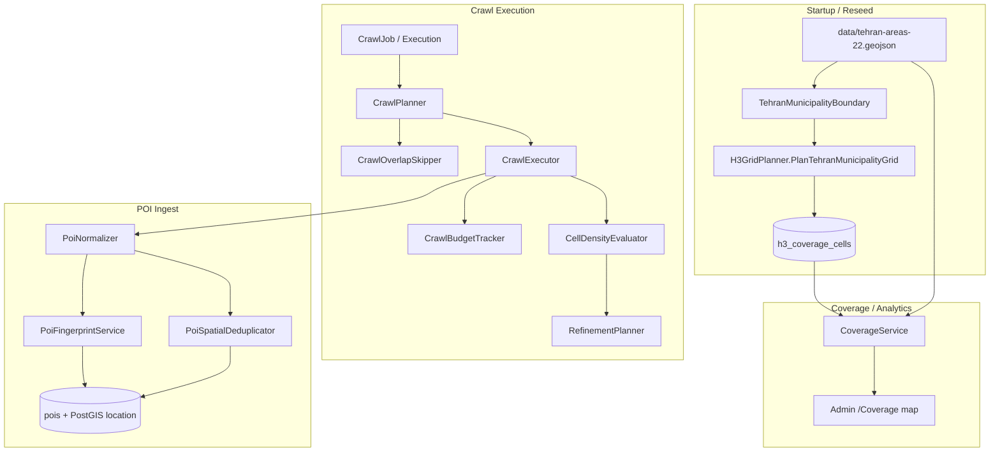

# Tehran POI Crawl Strategy (Production)

Production-grade Neshan Search crawl plan for Tehran municipality using adaptive H3 indexing, request budgeting, overlap optimization, and multi-stage deduplication.

## Goals

| Goal | Target |
|------|--------|
| Geographic scope | Official Tehran municipality (22 districts), **not** a rectangular bbox |
| Request budget | ≤ **15,000** Neshan Search calls per full-city crawl |
| Base resolution | **H3 res 7** (Phase 1) |
| Refinement | **H3 res 8** children **only** for dense cells (Phase 3) |
| Search radius | **2,000 m** (overlap planning disc; Neshan returns distance-sorted results) |
| Categories | All enabled `poi_categories` × configured search terms (27 today) |
| Resumability | Per-cell status in `h3_coverage_cells`; skip `success` unless `stale` |

---

## Architecture



### Components (code)

| Component | Path | Role |
|-----------|------|------|
| Boundary loader | `Infrastructure/H3/TehranMunicipalityBoundary.cs` | Parse 22-district GeoJSON, union geometry, point-in-polygon |
| Polygon polyfill | `Infrastructure/H3/H3CellGeometry.PolyfillMunicipality` | H3 `Fill` per district, keep centroids inside union |
| Grid planner | `Infrastructure/H3/H3GridPlanner.cs` | Phase 1 res-7 plan, 2 km overlap validation, budget cap |
| Grid seeder | `Infrastructure/H3/H3GridSeeder.cs` | Persist cells + PostGIS centroids |
| Budget tracker | `Infrastructure/Crawler/CrawlBudgetTracker.cs` | Per-execution + per-category request counters |
| Density evaluator | `Infrastructure/Crawler/CellDensityEvaluator.cs` | Phase 3 dense-cell detection |
| Overlap skipper | `Infrastructure/Crawler/CrawlOverlapSkipper.cs` | Skip redundant 2 km discs |
| Spatial dedup | `Infrastructure/Crawler/PoiSpatialDeduplicator.cs` | 50 m + normalized title fallback |
| Coverage API | `API/Controllers/CoverageController.cs` | Cells, boundary, summary, heatmap |

---

## Geometry Requirements

### Boundary source

- **File:** `data/tehran-areas-22.geojson` (22 Tehran municipal districts, OSM-derived)
- **Config:** `tehran.boundary.mode = municipality` (default)
- **Legacy:** `tehran.boundary.mode = bbox` uses rectangular `tehran.bounds` (deprecated)

### Phase 1 — Polygon polyfill (res 7)

```
FOR each district polygon D in municipality:
    indices += H3.Fill(D, resolution=7)
KEEP index IF centroid(index) ∈ union(municipality)
```

**No viewport polyfill. No bbox polyfill in municipality mode.**

Measured grid (current boundary file): **~114 res-7 cells**, **~3,078** base requests (114 × 27 terms).

Remaining budget (~12,000 requests) is reserved for Phase 3 refinement and overlap re-queries.

### Overlap validation (2,000 m)

Sample random points **inside** the municipality union (rejection sampling in envelope). Every sample must be within 2,000 m (Haversine) of at least one cell centroid. If validation fails, radius is stepped up (max 4,500 m) — config default remains **2,000 m**.

---

## Phase 2 — Category searches

For each res-7 cell centroid `(lat, lng)`:

```
FOR each enabled category C:
    FOR each search_term T in C.search_terms_json:
        Neshan GET /v1/search?term=T&lat=&lng=
```

Task identity: `(h3_index, category_id, search_term)` — enables incremental resume.

### Overlap optimization

Adjacent res-7 centroids are ~1.2 km apart; 2,000 m discs overlap ~40–60%.

**`CrawlOverlapSkipper` rules:**

1. Before executing a task, find neighboring cells with `status = success` within 2,000 m.
2. If ≥ 3 successful neighbors **or** overlap score ≥ 0.85 → **skip** API call.
3. Reuse POIs already ingested from neighbor cells (fingerprint dedup at upsert).

**Incremental resume:** Cells with `status = success` and fresh `last_success_at` are skipped on full crawl (configurable via job type: full vs stale-only).

---

## Phase 3 — Adaptive refinement (res 8)

**Never** refine the entire city. Only subdivide **dense** res-7 parents.

### Dense cell criteria (`CellDensityEvaluator`)

A res-7 cell is **dense** when **any** of:

| Signal | Threshold |
|--------|-----------|
| API `count` near limit | ≥ 28 results (of max ~30) |
| Normalized POI count in cell | ≥ 120 |
| Categories saturated | ≥ 3 categories each returning ≥ 20 results |

### Refinement action

```
IF dense(parent_res7):
    children = H3.children(parent, resolution=8) ∩ municipality
    FOR each child centroid:
        enqueue category × term tasks (same as Phase 2)
    INSERT h3_coverage_cells (resolution=8, parent_h3_index=parent, is_refined=true)
```

**Budget gate:** `CrawlBudgetTracker.CanRefine(estimated_child_requests)` must pass before creating children. Reserve **2,000** requests for refinement by default.

---

## Request Budget

| Parameter | Value |
|-----------|-------|
| `MaxCrawlRequests` | 15,000 |
| `ReservedForRefinement` | 2,000 |
| Base Phase 1 (114 cells × 27) | ~3,078 |
| Available for refinement + overlap | ~9,922 |

### `CrawlBudgetTracker` algorithm

```
state.used = 0
ON each Neshan call:
    IF state.used >= 15000: STOP crawl
    state.used++
    category_count[category_id]++

ON refinement proposal:
    IF state.used + child_tasks > 15000: REJECT refinement
```

### Adaptive stopping

- Stop when budget exhausted (graceful `completed` with partial coverage).
- Stop on Neshan quota (`NeshanQuotaExceededException`).
- Per-category cap (optional): `max_requests_per_category = 1500` — prevents one category consuming budget.

### Coverage estimation

```
coverage_percent = success_cells / total_cells × 100
area_covered_km² ≈ success_cells × π × 2km² (adjusted for overlap deduplication factor 0.65)
```

---

## Deduplication Strategy

### Stage 1 — Primary (fingerprint)

```
SHA256(normalized_title | neshan_type | lat_6dp | lng_6dp | normalized_address)
```

Upsert on `poi_fingerprint` unique index (existing `PoiRepository`).

### Stage 2 — Secondary (normalized text)

Normalize: lowercase, collapse whitespace, strip punctuation (Persian/Arabic aware in production).

### Stage 3 — Spatial fallback (`PoiSpatialDeduplicator`)

Duplicate if:

- Haversine distance **< 50 m**, AND
- `NormalizeTitle(a) == NormalizeTitle(b)`

→ Link to canonical record; do not insert duplicate.

### Stage 4 — Cross-cell reuse (overlap skip)

When overlap skipper fires, no new API call; existing POIs within 2,000 m disc satisfy coverage.

---

## Database Schema

### Existing (extended)

```sql
-- h3_coverage_cells (extended)
ALTER TABLE h3_coverage_cells
    ADD COLUMN parent_h3_index bigint NULL,
    ADD COLUMN is_refined boolean NOT NULL DEFAULT false,
    ADD COLUMN request_count integer NOT NULL DEFAULT 0;

-- centroid geography(point,4326) — unchanged
-- status: pending | success | failed | stale
```

### Recommended (Phase 3+)

```sql
CREATE TABLE crawl_cell_tasks (
    id uuid PRIMARY KEY,
    execution_id uuid NOT NULL REFERENCES crawl_job_executions(id),
    h3_index bigint NOT NULL,
    resolution smallint NOT NULL,
    category_id smallint NOT NULL,
    search_term text NOT NULL,
    status varchar(20) NOT NULL DEFAULT 'pending',
    skipped_overlap boolean NOT NULL DEFAULT false,
    api_result_count int,
    created_at timestamptz NOT NULL,
    completed_at timestamptz,
    UNIQUE (execution_id, h3_index, category_id, search_term)
);

CREATE TABLE tehran_admin_districts (
    id smallint PRIMARY KEY,
    name_fa text NOT NULL,
    boundary geography(MultiPolygon, 4326) NOT NULL
);

CREATE INDEX idx_pois_location_active
    ON pois USING GIST (location)
    WHERE superseded_at IS NULL;
```

### POI storage (unchanged)

| Column | Type | Notes |
|--------|------|-------|
| `location` | `geography(point,4326)` | Canonical geometry |
| `poi_fingerprint` | `varchar(64)` UNIQUE | Dedup key |
| `category_id` | `smallint` | Category FK |
| `source_payload` | `jsonb` | Raw Neshan item |

---

## PostGIS Implementation

### Point-in-municipality (serve + QA)

```sql
SELECT p.*
FROM pois p
JOIN tehran_admin_districts d
  ON ST_Covers(d.boundary::geometry, p.location::geometry)
WHERE p.superseded_at IS NULL
  AND ST_DWithin(
        p.location,
        ST_SetSRID(ST_MakePoint(:lng, :lat), 4326)::geography,
        :radius_meters);
```

### Cell centroid storage (seeder)

```csharp
db.Entry(cell).Property("Centroid").CurrentValue =
    new Point(lng, lat) { SRID = 4326 };
// persisted as geography(point,4326)
```

### Coverage gap query

```sql
-- Random municipality points not within 2km of any success centroid
SELECT ST_AsText(sample_point)
FROM municipality_samples s
WHERE NOT EXISTS (
    SELECT 1 FROM h3_coverage_cells c
    WHERE c.status = 'success'
      AND ST_DWithin(c.centroid, s.geom, 2000)
);
```

---

## Analytics Metrics

| Metric | Source |
|--------|--------|
| Total cells | `COUNT(h3_coverage_cells)` |
| Crawled cells | `status IN (success, stale)` |
| Refined cells | `is_refined = true` |
| Total requests | `SUM(request_count)` or execution `request_count` |
| Requests per category | `CrawlBudgetTracker.RequestsPerCategory` |
| Coverage % | `success / total` |
| Duplicate reduction % | `(api_results - unique_inserts) / api_results` |
| Covered area km² | PostGIS `ST_Area` on union of 2 km buffers × success cells |

Expose via `GET /api/coverage/summary` and future `GET /api/crawl/analytics`.

---

## Coverage Map (`/Coverage`)

1. **Boundary layer:** `GET /api/coverage/boundary` → 22-district GeoJSON outline.
2. **Cell layer:** `GET /api/coverage/cells?resolution=7` (no bbox filter in municipality mode).
3. Leaflet draws boundary first, then H3 hexagons clipped to municipality-shaped grid.

**Config passed to browser:**

```javascript
window.coverageConfig = {
  apiBase: 'http://localhost:5080',
  gridResolution: 7,
  boundaryMode: 'municipality',
  tehranBounds: { ... } // envelope for fallback zoom only
};
```

---

## Acceptance Criteria

| # | Criterion | Status |
|---|-----------|--------|
| 1 | Grid follows municipality boundary | ✅ Polygon polyfill + boundary overlay |
| 2 | Minimal coverage gaps | ✅ 2 km overlap validation inside boundary |
| 3 | Dense areas get res 8 | 🔧 `CellDensityEvaluator` + refinement planner (skeleton) |
| 4 | Sparse areas stay res 7 | ✅ Base grid res 7 only |
| 5 | Total requests < 15,000 | ✅ Budget tracker + base ~3k + refinement reserve |
| 6 | Duplicate POIs minimized | ✅ Fingerprint + spatial dedup + overlap skip |
| 7 | Incremental resume | ✅ Per-cell status; skip success on re-crawl |

---

## Configuration Keys

| Key | Default | Description |
|-----|---------|-------------|
| `tehran.boundary.mode` | `municipality` | `municipality` or `bbox` |
| `search.radius.default_meters` | `2000` | Overlap disc radius |
| `crawl.h3_resolution` | `auto` / `7` | Base grid resolution |
| `crawl.h3_reseed_on_startup` | `false` | Rebuild grid on mismatch |
| `crawl.max_requests` | `15000` | Hard budget cap |
| `crawl.refinement_reserve` | `2000` | Reserved for res-8 children |

---

## Reseed after upgrade

```sql
-- Migration 20260615130000_MunicipalityBoundaryGrid clears cells automatically
-- Restart API/Worker to reseed from municipality polygon
```

Or set `crawl.h3_reseed_on_startup = true` and restart.

---

## Sample Code Structure

```
src/
  Didibood.LocationAccess.Infrastructure/
    H3/
      TehranMunicipalityBoundary.cs    # GeoJSON → NTS union
      H3CellGeometry.cs                # PolyfillMunicipality
      H3GridPlanner.cs                 # PlanTehranMunicipalityGrid
      H3GridSeeder.cs                  # DB seed + reseed
    Crawler/
      CrawlBudgetTracker.cs
      CellDensityEvaluator.cs
      CrawlOverlapSkipper.cs
      PoiSpatialDeduplicator.cs
      CrawlPlanner.cs                  # cells × categories × terms
      CrawlExecutionRunner.cs          # parallel dispatch + budget
    Coverage/
      CoverageService.cs               # cells + boundary API
data/
  tehran-areas-22.geojson              # 22 municipal districts
docs/
  tehran-poi-crawl-strategy.md         # this document
```

---

## Related ADRs

- [ADR-001](adr/001-neshan-poi-identity-and-crawl-strategy.md) — POI fingerprint identity
- [ADR-002](adr/002-postgis-spatial-model.md) — PostGIS canonical geometry
